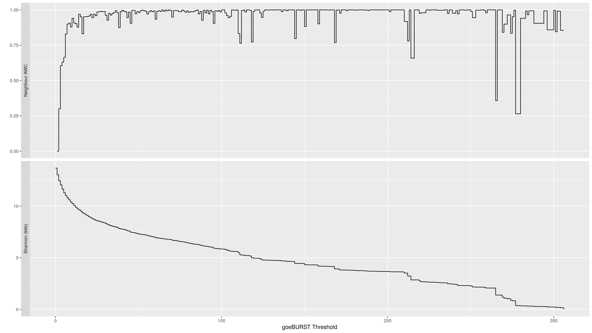

Neighbour Adjusted Wallace Coefficient (nAWC)
=====================================

Using the [Adjusted Wallace Coefficient](http://www.comparingpartitions.info/?link=Tut12) to identify regions of population (in)stability.

Prerequisites
-------------

```R
install.packages(c("ggplot2", "magrittr", "reshape2", "optparse"),
                   repos="https://cloud.r-project.org/")
```

Usage
----------

Clusters can be generated from [GrapeTree](https://github.com/achtman-lab/GrapeTree) via [this clustering script](https://github.com/dorbarker/grapetree_cluster)  

```sh
Rscript nawc.R -i clusters.csv -o results/ -d ,
```

```sh
$ Rscript nawc.R --help
Usage: nawc.R [options]


Options:
	-i FILE, --input=FILE
		Input table of clusters over thresholds

	-o DIR, --outdir=DIR
		Output directory - will be created if it doesn't already exist

	-d CHAR, --delimiter=CHAR
		Delimiter character for input [TAB]

	-h, --help
		Show this help message and exit

```



